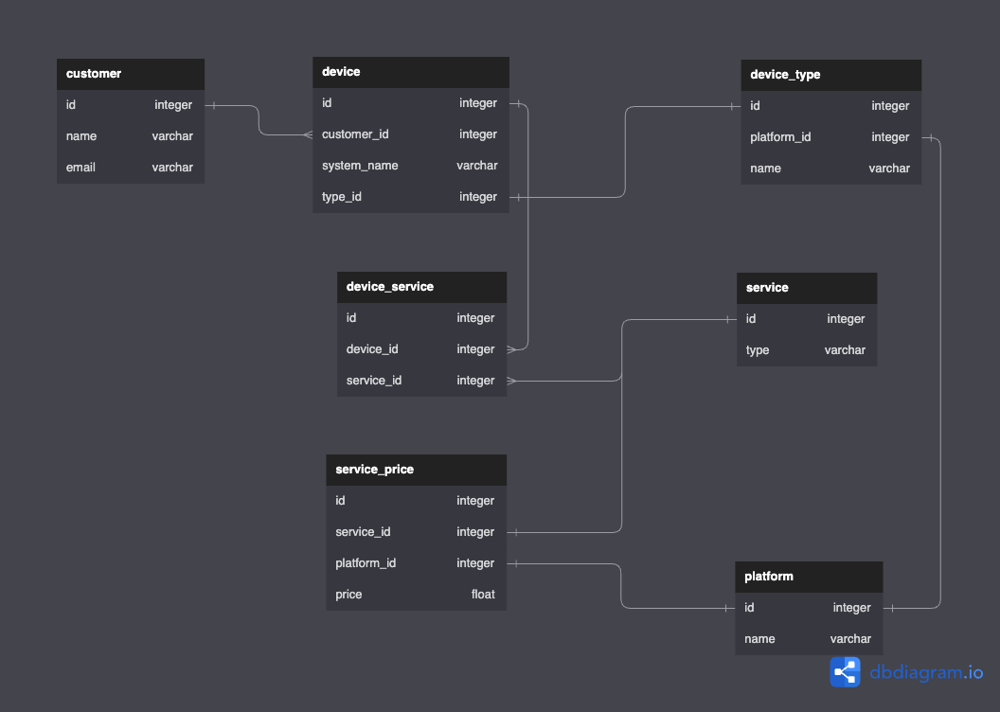

# rmm-api

This is a sample RMM API following these requirements:

> Implement a simple data model and persistence for Devices and the Services associated with them.
Implement endpoints and logic for the following.

> - Add, Delete (no edits) for Devices. Duplicate Devices should not be allowed.
> - Add, Delete (no edits) for Services and their cost. Duplicate Services should not be allowed.
> - Add, Delete (no edits) for Services assigned to a Device.
> - Calculate the total cost of the services depending on Services used by a Device.

It uses [H2 Embedded Relational Database](h2database.com) persisting data in file.

For integration tests, it is in-memory.

## data model



## running it

```
mvn spring-boot:run
```

## H2 console

`http://localhost:8080/h2`

JDBC url: `jdbc:h2:file:./db/rmm`
User Name: `sa`

## running integration tests

The integration tests cover all required functional requirements for the API in challenge's description. 

Additional endpoints that I've created are not being tested.

```
mvn clean verify -Pintegration-tests
```

## reproducing the sample scenario

    Customer with 2 Windows and 3 Macs, with the following Services:

    | Device Type | Antivirus | Backup | Screen Share |
    |-------------|-----------|--------|--------------|
    | Windows     | 2         | 1      | 2            |
    | Mac         | 3         | 2      | 2            |
    | **Total**   | **31**    | **9**  | **4**        |

    **Total Cost:** $64   
    Explanation:  
    &nbsp;&nbsp;Devices cost: $20  
    &nbsp;&nbsp;Antivirus cost: $31  
    &nbsp;&nbsp;Backup: $9  
    &nbsp;&nbsp;Screen Share: $4 
    
    
Remember: since the app persists data into disk, before running the script:

```
rm -rf db/*
```

Run the api:

```
mvn spring-boot:run
```

Then, run the script present in `src/main/resources/script`:

```
$ ./happy-path.sh

Created customer 'Tiago Melo'
Created Windows device named 'Windows 7'
Created Windows device named 'Windows 10'
Created MacOS device named 'MacOS v1'
Created MacOS device named 'MacOS v2'
Created MacOS device named 'MacOS v3'
Added Antivirus service to Windows device 'Windows 7'
Added Antivirus service to Windows device 'Windows 10'
Added Antivirus service to MacOS device 'MacOS v1'
Added Antivirus service to MacOS device 'MacOS v2'
Added Antivirus service to MacOS device 'MacOS v3'
Added Backup service to Windows device 'Windows 7'
Added Backup service to MacOS device 'MacOS v1'
Added Backup service to MacOS device 'MacOS v2'
Added Screen share service to Windows device 'Windows 7'
Added Screen share service to Windows device 'Windows 10'
Added Screen share service to MacOS device 'MacOS v1'
Added Screen share service to MacOS device 'MacOS v2'

Total cost for customer 'Tiago Melo':
{"customerId":1,"total":64}
```

## API documentation

When running the api, 

```
mvn spring-boot:run
```

the [Swagger](swagger.io) documentation can be accessed at `http://localhost:8080/swagger-ui/index.html`.


## enhancements

With more time available, I would:

- create unit tests. Check out an article of mine where I show them [here](https://www.linkedin.com/pulse/spring-boot-example-crud-restful-api-global-exception-tiago-melo/).
- use Gradle instead of Maven.
- update Swagger docs by giving concrete example payloads.

## reference articles of mine
- Database migrations with Liquibase: [https://www.linkedin.com/pulse/java-database-versioning-liquibase-tiago-melo/](https://www.linkedin.com/pulse/java-database-versioning-liquibase-tiago-melo/)

**about Spring Boot**
- Spring Boot: asynchronous processing with @Async annotation: [https://www.linkedin.com/pulse/spring-boot-asynchronous-processing-async-annotation-tiago-melo/](https://www.linkedin.com/pulse/spring-boot-asynchronous-processing-async-annotation-tiago-melo/)
- Java: centralized logging with Spring Boot, Elasticsearch, Logstash and Kibana: [https://www.linkedin.com/pulse/java-centralized-logging-spring-boot-elasticsearch-logstash-melo/](https://www.linkedin.com/pulse/java-centralized-logging-spring-boot-elasticsearch-logstash-melo/)
- Spring Boot Batch: exporting millions of records from a MySQL table to a CSV file without eating all your memory: [https://www.linkedin.com/pulse/spring-boot-batch-exporting-millions-records-from-mysql-tiago-melo/](https://www.linkedin.com/pulse/spring-boot-batch-exporting-millions-records-from-mysql-tiago-melo/)
- Java: an appointment scheduler with Spring Boot, MySQL and Quartz: [https://www.linkedin.com/pulse/java-appointment-scheduler-spring-boot-mysql-quartz-tiago-melo/](https://www.linkedin.com/pulse/java-appointment-scheduler-spring-boot-mysql-quartz-tiago-melo/)

